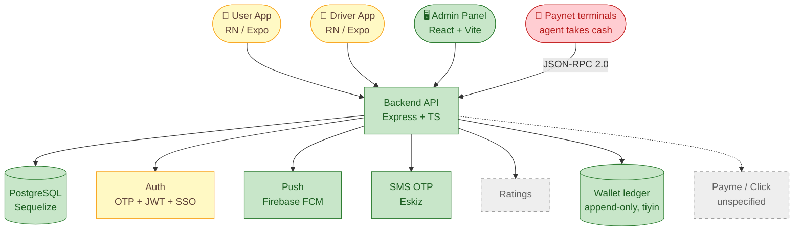
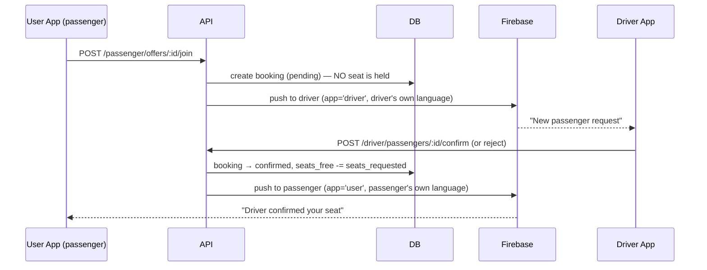

# 🗺️ ARCHITECTURE — visual map of the system

> **Rule for Claude:** whenever components, folders, or data flow change, update
> this file (command: `/arch`). Diagram colors show live status:
> 🟩 green = done · 🟨 yellow = in progress · ⬜ gray dashed = planned.
>
> **To SEE the diagrams in VS Code:** install the extension
> **"Markdown Preview Mermaid Support"**, open this file, press `Ctrl+Shift+V`.
> GitHub renders these diagrams automatically.

## 1. What is this system (one paragraph)

UbexGo is a passenger–driver ride-sharing platform for Uzbekistan (city and intercity).
Drivers register, add a vehicle, and post **ride offers** (route, time, seats, price).
Passengers browse published offers and **join** them; the driver confirms or rejects, and
both sides get push notifications. An **admin panel** moderates offers (approve/reject) and
manages users. Auth is phone-OTP (Eskiz SMS) plus Google SSO.

## 2. System overview (big picture)



> 🔴 **`PN` is red because of T-100, not because the code is unfinished.** The five implemented
> methods are verified against the real database; but the caller's IP never survives the proxy
> chain, so the **contractual** source-IP allow-list cannot work. **That blocks go-live.**

## 3. Component status (what is going on)

| Component | What it does | Status | Where in code |
|---|---|---|---|
| Backend API | REST API, business logic, moderation | 🔨 in progress | `api,admin,db/apps/api/src/` |
| Database | Users, drivers, vehicles, offers, bookings, push tokens | ✅ done (grows per feature) | `.../apps/api/src/database/` |
| Auth | Phone OTP (Eskiz), JWT access/refresh, Google SSO | 🔨 in progress — ⚠️ **the refresh token was received and thrown away in BOTH apps until 2026-08-08 (T-038)**, so every session died after 15 min. Now stored, with a refresh-and-retry behind a single in-flight promise at the `getHeaders` choke point. **Not yet confirmed working on a device** | `.../src/` (auth routes/services) · both apps `utils/tokenStore.ts` + `config/api.ts` |
| Driver offers | Create/submit/publish + status machine | ✅ backend done | `.../src/` + `DriverOffer` model |
| Passenger join | Passenger joins an offer, driver confirms/rejects | 🔨 **wired end-to-end in both apps**, audited 2026-08-02, 3 fixes landed, 14 open (T-026) | `.../src/` (passenger/driver offer routes) |
| Admin panel | Offer moderation, user/passenger management | ✅ done | `api,admin,db/apps/admin/src/` |
| Push notifications | Per-app FCM tokens (`user` / `driver`); sending, foreground handling, **and a durable record** | ✅ sending done. 🔨 **T-045 (2026-08-11, not yet deployed):** every ride event now also **writes a `notifications` row** — before this `createNotification` had **one caller in the whole API**, so a missed push left no trace anywhere. 🔒 `otp` is never persisted | API push services + `NotificationService.recordPush` + app `PushService.ts` |
| — Tapping a notification | Opens the relevant screen instead of the main menu | ✅ **device-confirmed 2026-08-11 (T-044/T-046)** for foreground + background — every push type with a real destination opens it in both apps. 🔴 **The KILLED-app tap still lands on the main menu (T-047)** — one cause found and fixed, but not the whole story; needs a `logcat` line, not more guessing. ⚠️ A foreground push used to be **logged and dropped**; it now shows a tappable toast | both apps: `services/PushService.ts`, `utils/notificationRouting.ts`, `navigation/RootNavigator.tsx` |
| Document photos | Driver uploads licence/passport/vehicle photos | 🔨 upload was always fine; **display was broken** until 2026-08-02 — a host-less `/uploads/...` was handed to `<Image>` in **18 fields across 5 screens** | `driver-app-standalone/utils/imageUrl.ts` + the Driver\* screens |
| Driver ← passenger orders | Browse passenger orders, open one, send an offer, manage sent offers | 🔨 **built 2026-08-08 (T-037)** — the backend was already complete; the search screen existed but was **registered in no navigator**, and 4 of 5 API functions had zero call sites. Now reachable from two new menu rows. **Never run on a device** | `driver-app-standalone/screens/{SearchPassengerOffers,PassengerOfferDetails,MyJoinRequests}Screen.tsx` |
| Passenger ← drivers who offered | Passenger sees every driver who bid on their request and accepts or declines one | 🔨 **built 2026-08-11 (T-024)** — the API and all three client functions already existed with **zero call sites**; the card was the missing screen. Closes the last hole in the loop **and** T-044's push-routing compromise. ⚠️ **Accepting is irreversible and auto-rejects every other driver** (server-side cascade), so it sits behind a dialog naming the count. **Never run on a device** | `user-app-standalone/screens/OfferDriversScreen.tsx` |
| Passenger order edit | Passenger edits an existing order instead of cancel-and-recreate | 🔨 **built 2026-08-08 (T-040)** — `PATCH` existed and was safe; nothing called it. Same screen as create, driven by an `offerId` route param. **Never run on a device** | `user-app-standalone/screens/CreatePassengerOfferScreen.tsx` |
| Driver registration (5 steps) | Personal info → passport → licence → vehicle → taxi licence | 🔨 **repaired 2026-08-11 (T-061), not yet on a device.** 🔴 **The API validates almost none of it:** all six validators in `middleware/validator.ts` were exported and mounted on **nothing**; only `passportValidation` is wired now (PINFL = exactly 14 digits — a 16-digit one used to save, the column is `TEXT`). The other four are **T-063**, to be mounted one at a time against their real payloads. ⚠️ Errors used to be unusable: the API blanked the field name (`{ field: '' }` into `"{field} noto'g'ri formatda"`) and the screens discarded `errors[]` unless the status was **422** — but Sequelize sends **400** and duplicates **409**. All five screens now read them on any status via `getFieldErrors()` and scroll to the first problem | `driver-app-standalone/screens/Driver*Screen.tsx` · `utils/formScroll.ts` · API `middleware/{validator,errorHandler}.ts` · `routes/driver.routes.ts` |
| Driver app | Auth, profile, vehicle, offers list | 🔨 in progress | `driver-app-standalone/` |
| — Offer wizard (4 steps) | Create/edit offer UI | 🔨 **built & wired** (3900 lines, registered in `MainNavigator`), not device-verified — was wrongly marked "planned" until 2026-08-02 | `driver-app-standalone/screens/OfferWizardScreen.tsx` |
| User app | Auth, browse & join offers | 🔨 in progress | `user-app-standalone/` |
| Wallet ledger | Three accounts per user (`real` money in **integer tiyin**, `token`, `bonus`); every movement is one row | ✅ **built 2026-08-14 (T-087), exercised for the first time 2026-08-16 by T-088.** 🔴 **APPEND-ONLY — nothing is ever updated or deleted; a correction is a new negated row citing the original.** That is what makes Paynet's error 77 answerable at all. `balance` on the account is a **cache**; the entries are the truth. **Idempotency is enforced by the DATABASE** — partial unique index on `(provider, external_id)` plus a CHECK closing the NULL hole | `.../models/Wallet{Account,Transaction}.ts` · `services/WalletService.ts` · `utils/ledger.ts` |
| Paynet top-ups | A customer hands cash to a Paynet agent; **Paynet's terminal calls us** | 🔨 **five of six methods built and VERIFIED against the real test3 database 2026-08-16 (T-088).** ✅ Proven: a repeated `transactionId` credits **once**; cancel restores the balance; unknown txn → 203; statement lists it once. 🔴 **`PAYNET_CALLS_US` — there is no outbound charge API in this contract.** 🛑 `ChangePassword` is a deliberate stub (nowhere to persist a rotated secret yet). 🛑 Blocked on **T-100** (IP allow-list) and on Paynet's credentials | `.../services/PaynetService.ts` · `controllers/PaynetController.ts` · `routes/paynet.routes.ts` · `middleware/paynet{Access,Auth}.ts` · `utils/paynet/` · **contract in `docs/PAYNET.md`** |
| — Source-IP gate | Refuses anything not from Paynet's two documented ranges | 🔴 **CODE CORRECT, DEPLOYMENT BROKEN (T-100).** It correctly refused a **forged** `X-Forwarded-For: 213.230.106.112` on the live server. But every request reaches the app as `10.42.0.1` — the caller's address is overwritten between the edge nginx and Traefik — so the list can admit **nobody or everybody**, and no `trust proxy` value can fix it | `middleware/paynetAccess.ts` · `utils/paynet/ipAllowList.ts` |
| Payme / Click top-ups | Other top-up providers | ⬜ **planned, and NOT covered by the Paynet documents** — different contracts (T-093) | — |
| Ride payment | Cash / card at the end of a ride | 🔨 **flags, not an enum** — `payment_cash` + `payment_card` (both selectable) + a separate `paid_by_friend` (T-031, migration applied). ⚠️ Ride prices are `DECIMAL(10,2)` **so'm**, while the wallet is integer **tiyin** — the two conventions meet in exactly one place (`utils/ledger.ts`) | `PassengerOffer` model · `CreatePassengerOfferScreen` |
| Ratings | Rate driver/passenger after trip | ⬜ planned | — |

## 4. Folder map

```
UbexGo/
├── CLAUDE.md                  ← rules & commands (Claude reads automatically)
├── docs/                      ← project memory (this folder)
├── api,admin,db/              ← backend monorepo-ish (NOTE: comma in the name)
│   ├── apps/
│   │   ├── api/               ← Express + TS + Sequelize backend
│   │   │   └── src/database/  ← models + migrations (.cjs)
│   │   └── admin/             ← React + Vite admin panel
│   ├── infra/                 ← docker compose, nginx, k8s  (ask before editing)
│   └── tmp/                   ← ⚠️ STALE duplicates — ignore
├── driver-app-standalone/     ← React Native / Expo (driver)
│   ├── components/AppModal.tsx     ← the ONE modal shell (T-036); look here before styling a modal
│   ├── components/BackButton.tsx   ← the ONE back button (T-071); 40×40 tile + arrow-back
│   └── utils/
│       ├── tokenStore.ts           ← access+refresh tokens, JWT `exp`; storage only, no network
│       ├── notificationRouting.ts  ← push-tap → screen, with a parked-intent queue
│       ├── pushEvents.ts           ← FOREGROUND push → screens re-fetch in place (T-068)
│       ├── driverProfileEvents.ts  ← registration step saved → RootNavigator re-checks (T-017)
│       ├── imageUrl.ts             ← /uploads/... → absolute URL (strips the /api suffix)
│       └── dateLimits.ts           ← document date bounds for the hand-rolled pickers
└── user-app-standalone/       ← React Native / Expo (passenger)
    ├── components/AppModal.tsx     ← byte-identical to the driver app's copy
    ├── components/BackButton.tsx   ← byte-identical to the driver app's copy
    ├── components/MenuButton.tsx   ← hamburger → Home (the app has no drawer)
    └── utils/
        ├── tokenStore.ts           ← byte-identical to the driver app's copy
        ├── pushEvents.ts           ← byte-identical to the driver app's copy
        └── notificationRouting.ts  ← same push-tap queue, own route map
```

> **Where the session lives.** `utils/tokenStore.ts` owns both tokens and the
> `exp` decoding; `config/api.ts` owns the refresh request and the single
> in-flight promise. They are split that way on purpose — `api/auth.ts` imports
> `config/api.ts`, so a network call inside `tokenStore` would close an import
> cycle. `getHeaders()` is the choke point every authenticated call already
> awaits, which is why the refresh needed no per-call-site retry wrapper.

> **Shared-by-copy, not by package.** The two apps are standalone, so
> `notificationRouting.ts` exists in both with the same shape but different route
> maps. A change to one is not a change to the other — check both.
> `AppModal.tsx`, `ModalList.tsx`, `DateWheelModal.tsx`, `tokenStore.ts`,
> `utils/contactPhone.ts` (T-054/T-056) and — since 2026-08-12 —
> **`utils/pushEvents.ts`** and **`components/BackButton.tsx`** (T-068/T-071) are
> **byte-identical** across the two apps — edit them together.
>
> **Two things worth knowing about the 2026-08-12 pair:**
> **`pushEvents.ts`** is the missing half of T-046. A push arriving while the app is
> OPEN reaches `onMessage` and nowhere else; T-046 made it *visible* (a tappable
> toast) but nothing told the screen underneath its data was stale — both
> `App.tsx` files passed **`undefined`** for the observer. Seven screens now
> subscribe. ⚠️ **Filtering lives in the module, not the screens:** `otp` is absent
> from `RIDE_DATA_PUSH_TYPES` so a code arriving mid-entry can never reload a list.
> ⚠️ **Refresh only — navigation still happens exclusively on a TAP.**
> **`BackButton.tsx`** replaced two families across 24 sites (a bare `<Text>←</Text>`
> and an `Ionicons arrow-back`). It is not only cosmetic: the text arrow **scales
> with the system font**, which is the T-050 overflow class.
> ⚠️ **Five sites deliberately still use the old markup** — the driver-registration
> screens render a *labelled* `← Orqaga` with a `disabled` state, not a bare arrow.
>
> **Not identical, and deliberately so:** `TimeWheelModal.tsx` (T-057) exists only
> in the **user** app — the create-offer screen is the only place that picks a time
> — and `PhotoSourceModal.tsx` (T-057) only in the **driver** app, where the five
> registration screens upload documents. Copy them across only when a second
> caller actually appears.
> ⚠️ **`DateWheelModal.tsx` gained an opt-in `minimumDate`** (T-069) so the trip
> picker can stop at today. It is **off by default on purpose**: the same component
> serves the **birth-date** screens, which must keep offering 1900→today.
>
> **`utils/formScroll.ts` (T-061) — driver app only.** `useFieldScroll()` remembers
> each field's y and scrolls to the topmost one carrying an error; all five
> registration screens use it. It generalises the on-focus scrolling the **user**
> app's `UserDetailsScreen` already had inline — that screen was the model, and is
> the obvious first caller if this is ever copied across.
> ⚠️ **`onLayout` reports y relative to the PARENT**, so a screen must register its
> form container (`rememberContainerOffset`) as well as its fields, or every jump
> lands short by the header's height — and a scroll to the wrong place still looks
> like it worked.

## 5. Main data flow (passenger joins an offer)



> ⚠️ **Joining does not reserve a seat** (corrected 2026-08-02 — this diagram used to say
> "reserve seat"). `seats_free` moves **only** at confirm (`OfferPassengerService.ts:275`) and is
> restored on cancel (:430). So any number of passengers can hold a pending request on the same
> seat, and the driver picks. That is intended — but it is also why `confirmPassenger` needs a
> transaction + row lock, which it does not yet have (**T-026**: two concurrent confirms both pass
> the seat check and oversell the car).

## 6. Decision log (why we chose things)

| Date | Decision | Why (1 line) |
|---|---|---|
| — | **Express** (not NestJS as the spec says) | Simpler, lighter for the team; spec was aspirational |
| — | Standalone RN apps split from the monorepo | Local APK builds broke under monorepo hoisting (`SOLUTION_MONOREPO_ISSUE`) |
| — | Push tokens stored **per app** (`app='user'\|'driver'`) | One person can be both driver & passenger under one `user_id` |
| — | Sequelize + PostgreSQL | Relational data (users ↔ offers ↔ bookings); matches the spec |
| 2026-07-21 | Adopted this `docs/` + `CLAUDE.md` control system | Kill 48 scattered fix-notes; one source of truth |
