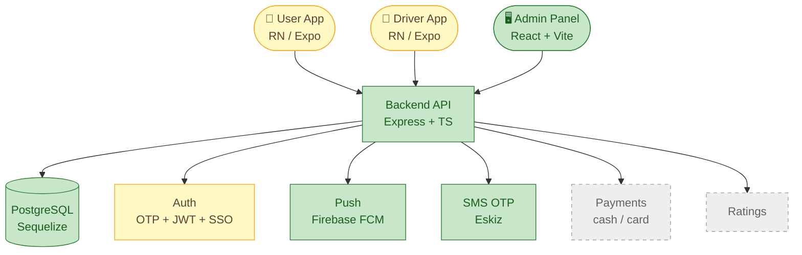
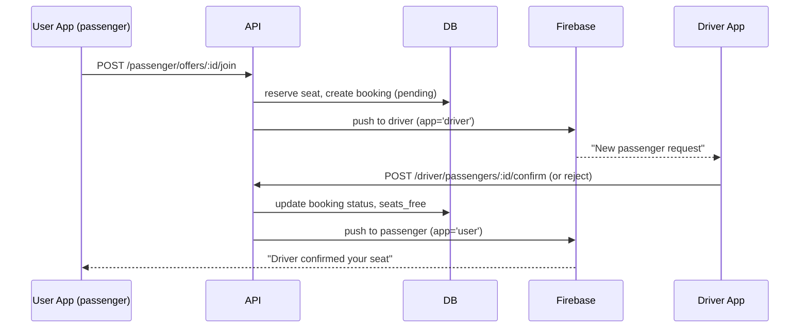

# 🗺️ ARCHITECTURE — visual map of the system

> **Rule for Claude:** whenever components, folders, or data flow change, update
> this file (command: `/arch`). Diagram colors show live status:
> 🟩 green = done · 🟨 yellow = in progress · ⬜ gray dashed = planned.
>
> **To SEE the diagrams in VS Code:** install the extension
> **"Markdown Preview Mermaid Support"**, open this file, press `Ctrl+Shift+V`.
> GitHub renders these diagrams automatically.

## 1. What is this system (one paragraph)

UbexGo is a passenger–driver ride-sharing platform for Uzbekistan (city and intercity).
Drivers register, add a vehicle, and post **ride offers** (route, time, seats, price).
Passengers browse published offers and **join** them; the driver confirms or rejects, and
both sides get push notifications. An **admin panel** moderates offers (approve/reject) and
manages users. Auth is phone-OTP (Eskiz SMS) plus Google SSO.

## 2. System overview (big picture)



## 3. Component status (what is going on)

| Component | What it does | Status | Where in code |
|---|---|---|---|
| Backend API | REST API, business logic, moderation | 🔨 in progress | `api,admin,db/apps/api/src/` |
| Database | Users, drivers, vehicles, offers, bookings, push tokens | ✅ done (grows per feature) | `.../apps/api/src/database/` |
| Auth | Phone OTP (Eskiz), JWT access/refresh, Google SSO | 🔨 in progress | `.../src/` (auth routes/services) |
| Driver offers | Create/submit/publish + status machine | ✅ backend done | `.../src/` + `DriverOffer` model |
| Passenger join | Passenger joins an offer, driver confirms/rejects | 🔨 in progress — **not verified** | `.../src/` (passenger/driver offer routes) |
| Admin panel | Offer moderation, user/passenger management | ✅ done | `api,admin,db/apps/admin/src/` |
| Push notifications | Per-app FCM tokens (`user` / `driver`) | ✅ done (recently fixed) | API push services + app `PushService.ts` |
| Driver app | Auth, profile, vehicle, offers list | 🔨 in progress | `driver-app-standalone/` |
| — Offer wizard (4 steps) | Create/edit offer UI | ⬜ planned | `driver-app-standalone/screens/OfferWizardScreen.tsx` |
| User app | Auth, browse & join offers | 🔨 in progress | `user-app-standalone/` |
| Payments | Cash / card | ⬜ planned | — |
| Ratings | Rate driver/passenger after trip | ⬜ planned | — |

## 4. Folder map

```
UbexGo/
├── CLAUDE.md                  ← rules & commands (Claude reads automatically)
├── docs/                      ← project memory (this folder)
├── api,admin,db/              ← backend monorepo-ish (NOTE: comma in the name)
│   ├── apps/
│   │   ├── api/               ← Express + TS + Sequelize backend
│   │   │   └── src/database/  ← models + migrations (.cjs)
│   │   └── admin/             ← React + Vite admin panel
│   ├── infra/                 ← docker compose, nginx, k8s  (ask before editing)
│   └── tmp/                   ← ⚠️ STALE duplicates — ignore
├── driver-app-standalone/     ← React Native / Expo (driver)
└── user-app-standalone/       ← React Native / Expo (passenger)
```

## 5. Main data flow (passenger joins an offer)



## 6. Decision log (why we chose things)

| Date | Decision | Why (1 line) |
|---|---|---|
| — | **Express** (not NestJS as the spec says) | Simpler, lighter for the team; spec was aspirational |
| — | Standalone RN apps split from the monorepo | Local APK builds broke under monorepo hoisting (`SOLUTION_MONOREPO_ISSUE`) |
| — | Push tokens stored **per app** (`app='user'\|'driver'`) | One person can be both driver & passenger under one `user_id` |
| — | Sequelize + PostgreSQL | Relational data (users ↔ offers ↔ bookings); matches the spec |
| 2026-07-21 | Adopted this `docs/` + `CLAUDE.md` control system | Kill 48 scattered fix-notes; one source of truth |
